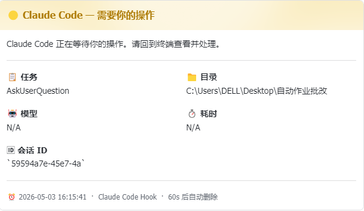
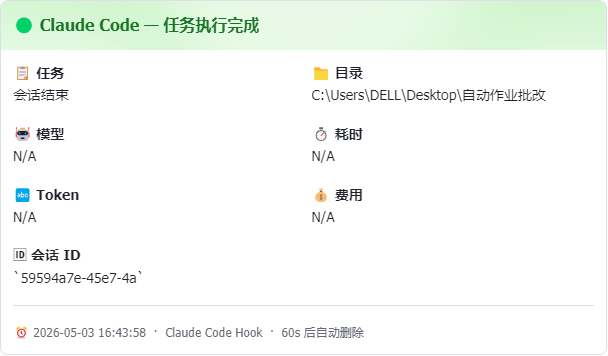
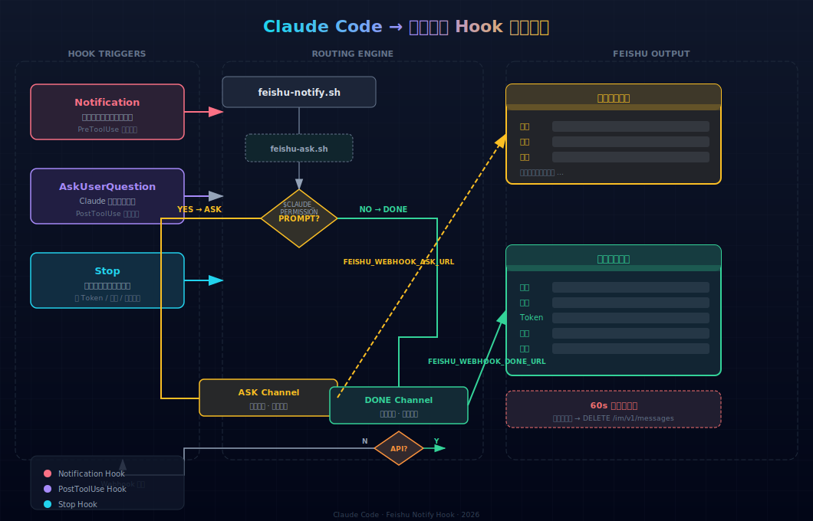

<div align="center">

<br>


**Zero-Config Webhook** | **Native API 阅后即焚** | **全生命周期 Hook**

**告别终端死盯。将 Claude Code 的每一次决策、耗时与 Token 开销，优雅地推送到你的飞书。阅后即焚，不留痕迹。**

<br>

<!-- 核心演示 GIF 占位图，请将录制好的 GIF 命名为 demo.gif 放入 assets 文件夹 -->

<div align="center">
  
</div>
<br>

---

<br>

<table align="center">
<tr>
<td width="33%" align="center">
  <h3>🟡</h3>
  <b>需要操作</b>
  <br><sub>权限弹窗 / 提问时</sub>
  <br><sub>立刻推送黄色卡片</sub>
</td>
<td width="33%" align="center">
  <h3>🟢</h3>
  <b>任务完成</b>
  <br><sub>会话结束自动推送</sub>
  <br><sub>Token · 耗时 · 费用</sub>
</td>
<td width="33%" align="center">
  <h3>🔥</h3>
  <b>阅后即焚</b>
  <br><sub>60 秒后自动删除</sub>
  <br><sub>API 模式下生效</sub>
</td>
</tr>
</table>


<br>

---

## 🎨 真实卡片预览

<p align="center">
  <!-- 这里放真实的飞书卡片截图，建议将图片放入 assets 文件夹 -->
  
  &nbsp;&nbsp;
  
</p>

---

## 🏗️ 架构总览

<p align="center">
  
</p>

> [!NOTE]
> **三层 Hook 覆盖** — `Notification` 捕获权限弹窗，`PostToolUse` 捕获主动提问，`Stop` 处理会话结束。API 失败自动降级 Webhook，消息不丢。

---

## 🚀 快速开始

### 📦 安装

```bash
mkdir -p ~/.claude/hooks
cp feishu-notify.sh feishu-ask.sh ~/.claude/hooks/
chmod +x ~/.claude/hooks/feishu-notify.sh ~/.claude/hooks/feishu-ask.sh
```

### ⚙️ 配置

将 `settings.hook.json` 合并到 `~/.claude/settings.json`，或手动添加：

```json
{
  "hooks": {
    "Stop": [{ "hooks": [{ "type": "command", "command": "bash ~/.claude/hooks/feishu-notify.sh" }] }],
    "PostToolUse": [{ "matcher": "AskUserQuestion", "hooks": [{ "type": "command", "command": "bash ~/.claude/hooks/feishu-ask.sh" }] }],
    "Notification": [{ "hooks": [{ "type": "command", "command": "bash ~/.claude/hooks/feishu-ask.sh" }] }]
  }
}
```

### 🔗 选择通道

飞书群 → 设置 → 群机器人 → 自定义机器人 → 复制 Webhook 地址，编辑脚本顶部：

```bash
FEISHU_WEBHOOK_ASK_URL="[https://open.feishu.cn/open-apis/bot/v2/hook/xxx](https://open.feishu.cn/open-apis/bot/v2/hook/xxx)"
FEISHU_WEBHOOK_DONE_URL="[https://open.feishu.cn/open-apis/bot/v2/hook/xxx](https://open.feishu.cn/open-apis/bot/v2/hook/xxx)"
```

> ⚠️ Webhook 不支持消息自动删除，其余功能完整。

> \[!IMPORTANT\] 需要 
> [飞书开放平台](https://open.feishu.cn)
> 创建应用并开启机器人能力。

```bash
FEISHU_APP_ID="cli_xxxxxxxx"
FEISHU_APP_SECRET="xxxxxxxx"
FEISHU_CHAT_ID_ASK="oc_xxxxxxxx"
FEISHU_CHAT_ID_DONE="oc_xxxxxxxx"
FEISHU_DELETE_AFTER_SEC=60   # 0 = 不删除
```

**所需权限**：`im:message:send` `im:message:delete`

### ✅ 验证测试

```bash
echo '{"event":"Stop","session_id":"test","cwd":"/project","model":"deepseek-v4"}' \
  | CLAUDE_TASK="测试消息" bash ~/.claude/hooks/feishu-notify.sh
```

* * *

📊 DONE 卡片内容
------------

<br>

<table>
<tr>
  <td><b>📋 任务</b></td>
  <td>Claude 当前执行的任务描述</td>
  <td><b>📁 目录</b></td>
  <td>项目工作目录</td>
</tr>
<tr>
  <td><b>🤖 模型</b></td>
  <td>当前使用的 AI 模型</td>
  <td><b>⏱️ 耗时</b></td>
  <td>X 分 Y 秒</td>
</tr>
<tr>
  <td><b>🔤 Token</b></td>
  <td>输入 / 缓存写入 / 输出 / 总计</td>
  <td><b>💰 费用</b></td>
  <td>预估 USD 费用</td>
</tr>
<tr>
  <td><b>🆔 会话 ID</b></td>
  <td>唯一会话标识</td>
  <td><b>🔥 自毁</b></td>
  <td>60s 后自动删除（API）</td>
</tr>
</table>

<br>

* * *

🛡️ Hook 覆盖矩阵
-------------

| 你看到的终端提示          | 触发来源           | Hook 事件      | 推送卡片    |
| ------------------------- | ------------------ | -------------- | ----------- |
| `Do you want to proceed?` | 权限弹窗           | `Notification` | 🟡 ASK 黄卡  |
| `是否允许执行 xxx?`       | Claude 提问        | `PostToolUse`  | 🟡 ASK 黄卡  |
| 会话结束（有待处理）      | Stop + 检测 Prompt | `Stop`         | 🟡 ASK 黄卡  |
| 会话结束（全部完成）      | Stop               | `Stop`         | 🟢 DONE 绿卡 |

> \[!TIP\] **所有场景无死角覆盖** — 放心去喝咖啡，不会被 Claude 的中途权限弹窗打断后忘记回来查看。

* * *

📂 文件结构
-------

```
claude-code-feishu-hook/
├── feishu-notify.sh         # 主脚本 · 路由 + 发送 + 自毁调度
├── feishu-ask.sh            # 包装器 · AskUserQuestion → ASK
├── settings.hook.json       # Hook 配置参考
├── diagram/
│   └── architecture.svg     # 架构流程图
├── assets/
│   ├── logo.svg             # 项目 Logo
│   ├── demo.gif             # 动态演示
│   ├── card-ask.png         # 黄色提醒卡片截图
│   └── card-done.png        # 绿色完成卡片截图
├── .gitignore
└── README.md
```

> [!TIP]
> **所有场景全覆盖** — 不会被 Claude 的权限弹窗打断后忘记回来查看。

* * *

💻 终端工作流演示
----------

```
$ claude "帮忙分析一下这个 Rust 模块的性能瓶颈，重点看看内存分配和并发机制"
...
Claude Code 执行中 ...

                         ┌─────────────────────────┐
 💬 飞书群消息 ← ← ←     │  🟢 Claude Code          │
                         │  任务执行完成            │
                         │  📋 Rust 模块性能分析    │
                         │  🤖 claude-3-7-sonnet   │
                         │  ⏱️ 1分45秒              │
                         │  🔤 总计 18,420 Tokens   │
                         │  ⏰ 60s 后自动删除        │
                         └─────────────────────────┘
                                      ↓
                                60 秒后消失 ✨
```

* * *

### ⭐ 觉得好用？给个 Star 支持一下

**[Star this repo](https://github.com/hxd77/Claude-Code-Feishu-Notify) · [Report Bug](https://github.com/hxd77/Claude-Code-Feishu-Notify/issues) · [Request Feature](https://github.com/hxd77/Claude-Code-Feishu-Notify/issues) **

MIT License · Built with Claude Code

